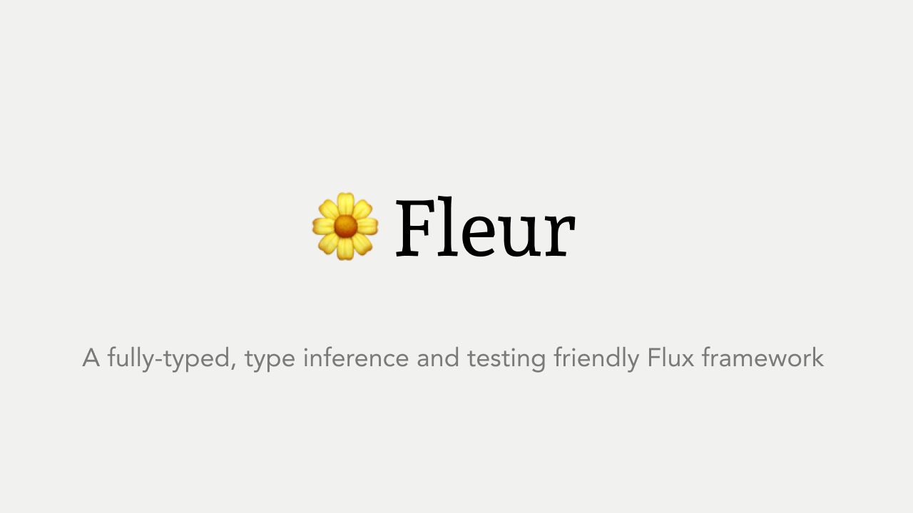

# 🌼 Fleur 🌼 [](https://travis-ci.org/fleur-js/fleur)

An Fully-typed Flux framework inspired by Fluxible.  
Runs on Node / Web.

(No dependence to React. See [this](https://www.npmjs.com/package/@fleur/react) if you want to use with React.)

Social hashtag: #fleurjs

## Feature

- Comfortable to write code
  - Fully typed. Friendly to type inference.
- Next.js supported with [`create-fleur-next-app`](./pkgs/create-fleur-next-app)
- **Completely** Server-side rendering support
- Support React Hooks in `@fleur/react`

## Packages

- [@fleur/fleur](./pkgs/fleur) - Basic flux-flow framework
- [@fleur/react](./pkgs/react) - Fleur react connector
- [@fleur/testing](./pkgs/testing) - Fleur Test helpers
- [@fleur/create-next-app](./pkgs/create-next-app) - Create Next.js app with Fleur
- [@fleur/next](./pkgs/next) - Next.js integration helpers
- [@fleur/di](./pkgs/di) - Library independent DI function
- [fleur-benchmarks](./pkgs/fleur-benchmarks) - Benchmarks. (Fleur vs Fluxible vs react-redux)
- ~~[@fleur/route-store-dom](./pkgs/route-store-dom) - Fleur DOM router~~
  - Use [`@fleur/froute`](https://github.com/fleur-js/froute) instead.

## Usage

### Recommended structure

Fleur recommends [`Re-ducks`](https://github.com/alexnm/re-ducks) like directory structure.  
See file details on [`pkgs/fleur/README.md`](./pkgs/fleur/README.md)

```
app/
  domains/
    User/
      actions.ts
      operations.ts
      store.ts
      selector.ts
    Article/
      actions.ts
      operations.ts
      store.ts
      selector.ts
  # and any components structure you liked (Atomic, Smart / dumb, etc...)
  components/
  containers/
```
